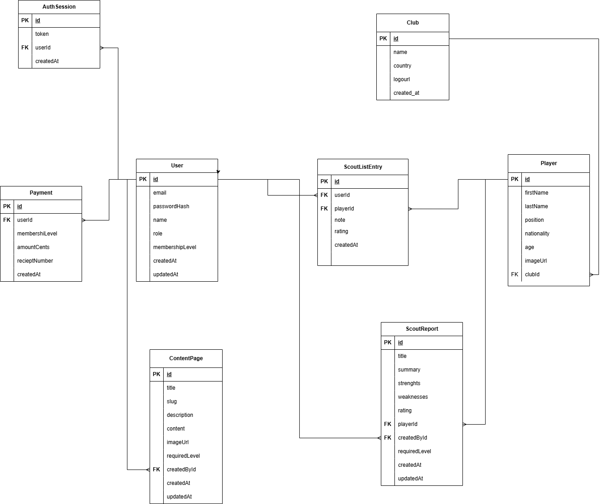

# ScoutRoom

ScoutRoom är en webbaserad scoutingplattform för fotboll där användare kan utforska spelare och scoutinginnehåll.

Projektet är byggt som en gruppuppgift i kursen Systemutveckling.

## Teknik

### Frontend
- React
- TypeScript
- Vite

### Backend
- Node.js
- TypeScript
- Express
- Prisma

### Databas
- PostgreSQL

## Funktioner

- Registrering och inloggning
- Tre medlemsnivåer
- Låtsasbetalning och kvitton
- Innehåll med olika behörighetsnivåer
- Admin kan skapa innehåll
- ScoutList
- Spelare och klubbar lagras i databasen

## Deployment

Webb:
https://web-mango-bear.spcf.app

API:
https://api-mango-bear.spcf.app

## Databasdiagram

